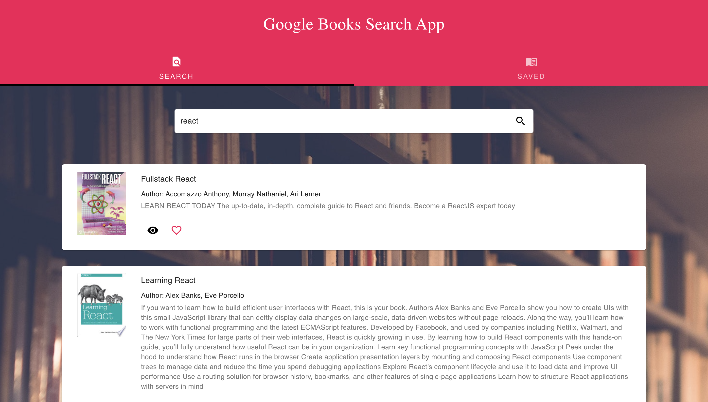

[](https://github.com/xtineroq?tab=followers)

# Google Books Search App

## Description
➤ This application uses react components with helper/util functions, and utilizes React lifecycle methods to query and display books based on user searches. Node, Express and MongoDB were also used so that users can save books to review or purchase later.

## Table of Contents
* [Installation](#installation)
* [Usage](#usage)
* [License](#license)
* [Contributing](#contributing)
* [Tests](#tests)
* [Questions](#questions)
* [Screenshots](#screenshots)
* [Deployed Application](#deployed-application)

## Installation
```
Run npm i to install all dependencies
```

## Usage
➤ Run npm start to start the application

## License
This app is covered under the following license/s:


## Contributing
➤ This project is open-source. Contributions are welcome. Please contact the author for more information.

## Tests
```
npm run test
```

## Questions
Please direct all questions to:

👤 https://github.com/xtineroq

📧 mcroque89@gmail.com

## Screenshots




## Deployed Application
[View on Heroku](https://still-depths-35149.herokuapp.com/)